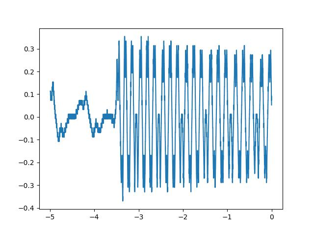
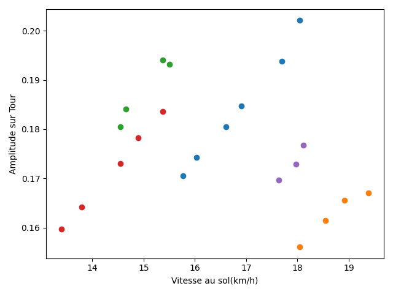

### Résumé:
Ces mesures effectuées le lundi 16 decembre 
sont destinées a établir une relation vitesse amplitude.

Il s'agit de réaliser le script python adapté pour leur analyse,
pour repérer dans le signal le défaut indicateur de tour.

- il s'agit d'une petite bosse de crête.
- elle s'explique par le nombre d'aimants (6) et le nb de cadrans pour les caser (7)
  ajouter un 7eme aimant aurait été inutile (alternances poles N/S)
  il y a donc un cadran sans aimant.

Ensuite il faut utiliser les informations de temps 
et de nombre de tour pour déduire un vitesse de rotation angulaire

On pourra dans un premier temps étudier l'enveloppe du signal,
pour si possible négliger la perte de vitesse dûe aux frottements.

### contenu du répertoire:

-> data & data_old (mesures au format csv)
-> viz (tracé des mesures au format jpeg)
-> assets (images et autres uties pour compte rendu)
main.py
README.md

### Commentaires de mesure:

data: mesures récentes après avoir observé (malheureusement un peu tard) un mauvais départ de la plupart des mesures.
les mesures anciennes sont appellées "zcope", les nouvelles: "gcope".
points les plus intéressants: interesting_mes.txt

après labellisation avec mon outil: `pipeline/labeling`
on peut calculer la vitesse du vélo par rapport à la route 2\*pi\*R/T avec T la période de rotation et R le rayon de la roue\
si on scatter les amplitudes de chaque mesure intéressante en fonction de la vitesse on obtient des droites de pente égale:

