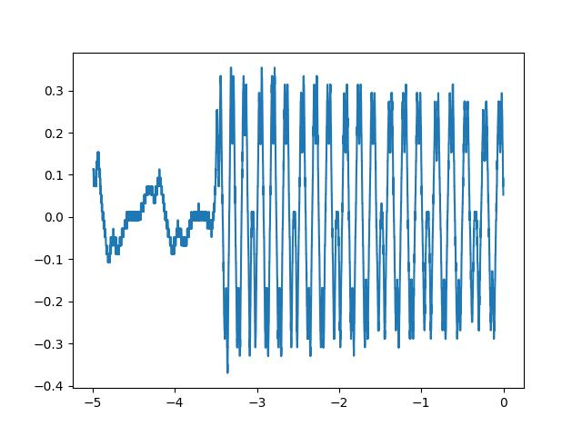
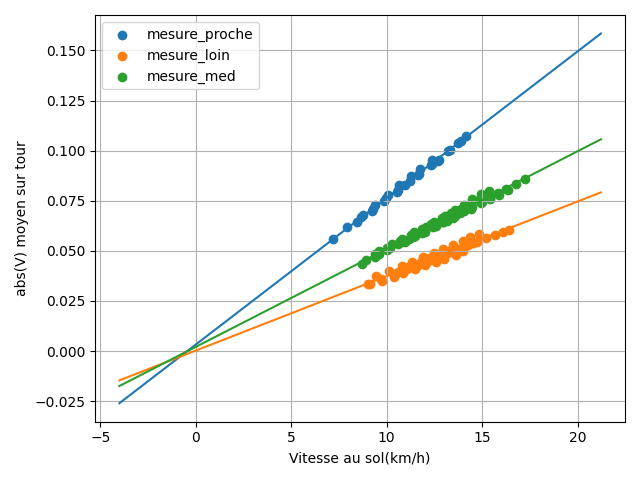

### Préambule:
merci de ⭐ si cette repo vous a été utile, pas besoin de me créditer dans ce cas.

sur-ce: bonne lecture! Je suis ouvert à tout push request de clarification/mise en page sur les documents d'explication.

Téléchargement: Zip/git en haut à droite.

### Résumé:
Ces mesures effectuées le lundi 16 decembre 
sont destinées a établir une relation vitesse amplitude.

Il s'agit de réaliser le script python adapté pour leur analyse,
pour repérer dans le signal le défaut indicateur de tour. (ASTUCE MAGIQUE ET ACCIDENTELLE!!! d'après les simulations ne fonctionnera pas si il y a trop d'aimants mais on peut faire par analyse de fréquence ou temps entre coupures du 0 après filtrage passe bas judicieux, le tout est de savoir d'où viennent les données, comment on les regroupe pour avoir plusieurs mesures cohérentes de la même expérience, et comment on les traite)

- il s'agit d'une petite bosse de crête.
- elle s'explique par le nombre d'aimants (6) et le nb de cadrans pour les caser (7)
  ajouter un 7eme aimant aurait été inutile (alternances poles N/S) impose un nombre pair
  il y a donc un cadran sans aimant.

Ensuite il faut utiliser les informations de temps 
et de nombre de tour pour déduire un vitesse de rotation angulaire

On pourra dans un premier temps étudier l'enveloppe du signal,
pour si possible négliger la perte de vitesse dûe aux frottements.

> commentaire en post: finalement les frottements font tout le boulot de ralentir la roue pour avoir ma courbe d'amplitude/vitesse en supposant la vitesse decroissante ~ constante sur un tour

### contenu du répertoire:

-> data & data_old (mesures au format csv)\
-> viz (tracé des mesures au format jpeg)\
-> assets (images et autres uties pour compte rendu)\
-> sim (je sais plus... pour la vraie simul /!\ voir -> `teslametre`)\
-> teslametre (mesures de B(vecteur) . n (vecteur normal à la bobine) dans l'espace mm/mm sur un large carré)\
  ----> mesuresB_n.csv - (les mesures en question /!\ décalage sur les x sûrement dû à un décalage de l'élément hall dans la sonde du lycée pas forcément au "0" car plastique devant pour protéger)\
  ----> mod_dist, mod_lat, et viz normalement commentés? je sais plus...\
-> pipeline: gestion des fichiers de mesure et traitement du signal avec interface visuelle - voir [Pipeline.md](https://github.com/FuriousBird/TIPE_Dynamo/tree/main/pipeline#readme) pour plus  d'explication sur l'usage\
  ----> labeling.py: outil visuel de pointage (que si les choses à pointées sont centrées sur le 0 mais modifiable rapidos avec chatGpt *wink wink*\
  ----> speed_dist.py/speed_dist.ipynb: utilise les mesures spécifiées dans [/interesting_mes.txt](https://github.com/FuriousBird/TIPE_Dynamo/blob/main/interesting_mes.txt) pour tracer les courbes vitesse / amplitude (à modifier en fait je sais plus ce qu'il fait exactement)\
main.py\
⚠ MCOT PAS EXEMPLAIRE (CATASTROPHE mais c'est passé)\
tout ce qui touche à reelight et son dispositif d'induction est accessible en démontant votre dispositif perso avec du matériel de consommateur et je me dégage de toute responsabilité sur l'utilisation que vous ferez de ces infos, le dispositif pouvant être breveté, je peux seulement conclure qu'ils utilisent les effets magnétiques démontrés dans ce TIPE pour optimiser leur circuit.\
[Présentation finale PowerPoint](https://github.com/FuriousBird/TIPE_Dynamo/blob/main/presentation_final.pdf) ON REMARQUERA QUE JE PARS D'UN PROBLEME DE SOCIETE DE SECURITE ROUTIERE et de signalisation de nuit pour introduire l'importance vitale du sujet. Sur un autre thème cette intro doit être adaptée.\
README.md

# ⚠⁉ WHAT
> bref c'est le bordel ça a évolué et tout est pas toujours bien rangé mais il y a des mesures vraiment utiles et on peut voir ci-dessous l'efficacité du processus pour obtenir des résultats cohérents.

### Commentaires de mesure:

data: mesures récentes après avoir observé (malheureusement un peu tard) un mauvais départ de la plupart des mesures.
les mesures anciennes sont appellées "zcope", les nouvelles: "gcope".
points les plus intéressants: interesting_mes.txt

après labellisation avec mon outil: `pipeline/labeling`
on peut calculer la vitesse du vélo par rapport à la route 2\*pi\*R/T avec T la période de rotation et R le rayon de la roue\
si on scatter les amplitudes de chaque mesure intéressante en fonction de la vitesse pour différentes distances. On montre la linéarité de l'amplitude en fonction de la vitesse. Pondérée par un facteur de distance à l'évolution plus compliquée et loin de l'idéalité (dipôle parfait cours de e-mag)

Résultats de simul superposés avec vraie mesure ~15km/h l'amplitude double est dûe au modèle de bobine plate considéré, loin de la bobine réelle qui possède une profondeur.
Le dispositif commercial utilise aussi des fils de cuivre plus fins (plus de tours sur une même surface) sur un coeur en ferrite pour guider les lignes de champ magnétique et augmenter son flux dans la bobine et donc sa variation depuis/vers cette valeur max élevée qui se traduit en Force Electromotrice Induite -> attention à la chute de tension sur des dispositifs à faible impédance, qui peut aussi être étudiée.

